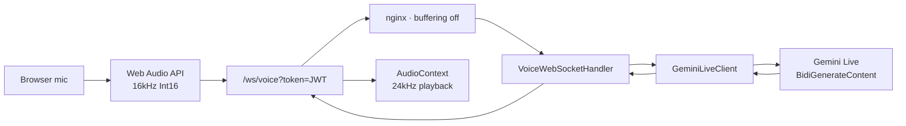

# myvoice

A ChatGPT-like, low-latency conversational voice agent built on a fullstack SaaS starter.

[](LICENSE)

**Stack:** Spring Boot 3.5.16 · Java 21 · React 19 · TypeScript 5.9 · Vite 7 · Tailwind CSS 3.4 · MySQL 8.0 · Redis 7 · Docker Compose · nginx

---

## Features

- **Audio-native voice chat** via Gemini Live API (Gemini 2.5 Flash Native Audio) — no STT → LLM → TTS chaining
- **~0.5–1.5s first-token latency** with gap-free PCM playback in the browser
- **Barge-in** — mic keeps streaming during playback; Gemini server-side VAD handles interruption
- **Multilingual** — English, Bangla, and Korean (Gemini Live native; system prompt switches to the user’s language)
- **JWT-authenticated WebSocket** (`/ws/voice?token=…`) with rate limits, per-user session caps, and audit logging
- Full SaaS foundation underneath: auth, roles, Redis, MySQL, Docker Compose, nginx SPA proxy

---

## Idea / Why

Most “voice assistants” chain three models (speech-to-text → LLM → text-to-speech). That adds latency and loses prosody. **myvoice** talks to Gemini Live over a bidirectional WebSocket and streams raw PCM both ways, so conversation feels closer to a phone call than a form submit.

The agent sits on a production-minded Spring Boot + React SaaS base (JWT, CORS, rate limiting, Docker), so the voice path is a first-class product feature—not a demo script.

---

## Architecture

```
 Browser mic
      │
      ▼
 Web Audio API
 (downsample → 16 kHz mono PCM Int16, 20 ms chunks)
      │
      ▼
 WebSocket  /ws/voice?token=<JWT>
 (nginx proxy · Upgrade · proxy_buffering off)
      │
      ▼
 Spring Boot  VoiceWebSocketHandler
      │
      ▼
 GeminiLiveClient
 wss://generativelanguage.googleapis.com/.../BidiGenerateContent
      │
      ▼
 Gemini streams 24 kHz PCM + transcripts
      │
      ▼
 Relayed to browser → gap-free AudioContext playback

 Barge-in: mic keeps streaming during playback;
           Gemini server-side VAD handles interruption.
```



---

## Project structure

```
fullstack-saas/
├── saas-springboot/                 # Backend (Spring Boot 3.5 / Java 21)
│   └── src/main/java/.../saas/
│       ├── Config/
│       │   ├── Properties/VoiceProperties.java
│       │   ├── VoiceWebSocketConfig.java
│       │   └── SecurityConfig.java      # /ws/** permitAll; CSP connect-src
│       ├── Security/
│       │   └── JwtHandshakeInterceptor.java
│       └── Services/Voice/
│           ├── VoiceWebSocketHandler.java
│           ├── GeminiLiveClient.java
│           ├── VoiceListener.java
│           └── AudioCodec.java
├── saas-reactjs/                    # Frontend (React 19 / Vite 7)
│   ├── nginx.conf
│   └── src/
│       ├── hooks/
│       │   ├── useVoiceRecorder.ts
│       │   ├── useAudioPlayer.ts
│       │   └── useVoiceSession.ts
│       └── pages/voice/
│           └── VoiceAgentPage.tsx       # Route /voice
├── docker-compose.yml               # db :3307, redis :6381, app :9090, frontend :5174
├── .env.example
└── README.md
```

---

## Frontend

### `useVoiceRecorder.ts`

Captures mic audio with `getUserMedia` + `AudioContext` + `ScriptProcessorNode`, downsamples to **16 kHz mono**, and emits **Int16** chunks (320 samples ≈ 20 ms). States: `idle` | `recording` | `denied` | `error`.

### `useAudioPlayer.ts`

Converts inbound **24 kHz Int16** PCM to Float32 `AudioBuffer`s and schedules them gap-free on an `AudioContext`. Exposes `playChunk()`, `stop()`, `isPlaying()`, and `ensureContext()` (call from a user gesture for autoplay policy).

### `useVoiceSession.ts`

Owns the WebSocket lifecycle:

- JWT from storage → `/ws/voice?token=…`
- Binary send/receive for PCM
- JSON frame dispatch: `user_transcript`, `assistant_transcript`, `interrupted`, `error`
- Ping/pong RTT measurement
- Exponential backoff reconnect: **1s / 2s / 5s**, max **3** attempts
- No-reconnect close codes: `RATE_LIMITED`, `SESSION_LIMIT`, `VOICE_DISABLED`, `GEMINI_CONNECT_FAILED`

### `VoiceAgentPage.tsx`

Protected `/voice` page under `UserLayout` (nav: **Voice Agent**):

- Mic button, live transcript bubbles (streaming; replaces last same-role message)
- Status pill with RTT badge; End / Retry; headphones hint; error toasts
- Barge-in: `player.stop()` on `interrupted`
- Accessibility: `aria-live`, `aria-pressed`, focusable transcript log

---

## Backend

### `VoiceProperties` (`app.voice.*`)

| Property | Env | Notes |
|----------|-----|--------|
| `geminiApiKey` | `GEMINI_API_KEY` | Warns if missing; voice degrades gracefully |
| `geminiModel` | `GEMINI_LIVE_MODEL` | Default `gemini-live-2.5-flash-native-audio` |
| `systemPrompt` | `VOICE_SYSTEM_PROMPT` | Instructs language switching |
| `maxSessionsPerUser` | `VOICE_MAX_SESSIONS_PER_USER` | Default `1` |

Missing API key → warn at startup; clients get a `VOICE_DISABLED` frame.

### `JwtHandshakeInterceptor`

Validates `?token=` JWT at handshake (rejects blank, blacklisted, expired/malformed). On success, stores `userId`, `username`, and `user` in WebSocket attributes.

### `VoiceWebSocketHandler`

Relay between browser and Gemini:

- Binary in → Gemini `realtimeInput`
- Gemini output → binary PCM / JSON frames to the browser
- Per-user session cap, `RateLimitService`, `AuditService` (`VOICE_SESSION_START` / `VOICE_SESSION_END`)
- Thread-safe sends (`synchronized` on the session)

### `GeminiLiveClient`

Uses `java.net.http.WebSocket` (no third-party WS dependency) to:

`wss://generativelanguage.googleapis.com/ws/.../BidiGenerateContent`

Setup includes `generationConfig.responseModalities: AUDIO`, `realtimeInputConfig.automaticActivityDetection`, and transcriptions. Audio is sent only after **`socketReady` + `setupComplete`**. Handles **BINARY** frames (`setupComplete` as binary JSON; model audio as raw PCM) and JSON text frames. Wire format: base64 PCM **16 kHz in / 24 kHz out**.

### `AudioCodec`

Base64 helpers and chunk math (20 ms @ 16 kHz = **320** frames).

### Security notes

- Spring Security: `/ws/**` is `permitAll` — real auth is at handshake
- CSP includes `connect-src 'self' ws: wss:`

---

## Infrastructure

### Docker Compose

| Service | Image / build | Host port |
|---------|---------------|-----------|
| `db` | `mysql:8.0` | **3307** → 3306 |
| `redis` | `redis:7-alpine` | **6381** → 6379 |
| `app` | Spring Boot | **9090** |
| `frontend` | nginx (React build) | **5174** → 5173 |

Healthchecks on MySQL/Redis; `app` `depends_on` healthy DB; frontend depends on `app`. Voice-related env vars are passed into `app`.

### nginx (`saas-reactjs/nginx.conf`)

- `/api` and `/uploads` → backend
- `/ws` → backend with `Upgrade` / `Connection` headers, **`proxy_buffering off`**, `proxy_read_timeout 3600s`
- SPA fallback via `try_files`

### Remote access (Tailscale)

`tailscale serve` can expose HTTPS (auto-cert), e.g. `https://uddins-macbook-air-2.tail023d45.ts.net`, so a phone can use the mic (secure context). **CORS must include that exact Origin** in `APP_CORS_ALLOWED_ORIGINS`.

---

## Design

Dark glass UI aligned with `UserLayout`:

- Slate-900 → blue-900 gradient, backdrop-blur, blue accent glows
- Emerald status pill; pulsing gradient mic button (square icon while recording)
- Rounded transcript bubbles — user (blue, right), assistant (slate, left)
- RTT badge; responsive `max-w-2xl` centered layout; accessible controls

---

## Quick Start

1. `cp .env.example .env` — fill **`GEMINI_API_KEY`** and a JWT secret (**32+ characters**)
2. `docker compose up -d --build`
3. Open:
   - Frontend: http://localhost:5174
   - Backend: http://localhost:9090
   - Swagger: http://localhost:9090/swagger-ui/index.html
4. Register / login (email verification disabled by default via `APP_REQUIRE_EMAIL_VERIFICATION_FOR_LOGIN=false`)
5. Open **/voice**, allow the mic, talk (headphones recommended)

---

## Configuration

Key environment variables (root `.env` / Compose):

| Variable | Purpose |
|----------|---------|
| `GEMINI_API_KEY` | Gemini Live API key (required for voice) |
| `GEMINI_LIVE_MODEL` | Live model id (default native-audio Flash) |
| `VOICE_SYSTEM_PROMPT` | System instruction (language switching, tone) |
| `VOICE_MAX_SESSIONS_PER_USER` | Concurrent voice sessions per user |
| `APP_REQUIRE_EMAIL_VERIFICATION_FOR_LOGIN` | Set `false` for local/dev without SMTP |
| `APP_CORS_ALLOWED_ORIGINS` | Comma-separated origins (include Tailscale serve URL if used) |
| `APP_JWT_SECRET` | JWT signing secret (32+ chars) |
| DB / Redis / email vars | MySQL, Redis, SMTP as in `saas-springboot/env.example` |

---

## Testing

### Backend

```bash
cd saas-springboot
./mvnw -ntp test
```

**40 tests**, including voice coverage:

- `GeminiLiveClientTest` (12)
- `VoiceWebSocketHandlerTest` (7)
- `JwtHandshakeInterceptorTest` (4)
- `VoicePropertiesTest`, `AudioCodecTest`, `JacksonConfigTest`, `AppConfigTest`

### Frontend

```bash
cd saas-reactjs
npx vitest run          # 16 hook tests
npm run build
npm run type-check
```

---

## Troubleshooting / Gotchas

Lessons learned shipping this path:

1. **Gemini Live sends `setupComplete` as a BINARY frame**, not text — handle binary JSON **and** raw PCM on the same socket.
2. **Audio sent before `setupComplete` is silently dropped** — gate `sendAudio` on `socketReady` + `setupComplete`.
3. **VAD needs trailing silence** to detect end-of-speech (test fixtures must include it).
4. **No real SMTP** → verification emails never send; disable with `APP_REQUIRE_EMAIL_VERIFICATION_FOR_LOGIN=false`.
5. **Bare `ObjectMapper` bean** shadowed Jackson auto-config → `LocalDateTime` serialization broke error responses; fixed with `JavaTimeModule`.
6. **CORS** — the browser sends an `Origin` header; include the Tailscale / `serve` origin in `APP_CORS_ALLOWED_ORIGINS`.

---

## Roadmap

- Stronger reconnect UX and session resume hints
- Configurable voices / system prompts per user
- Metrics dashboards for voice RTT, session duration, and interrupt rates
- Hardening for multi-instance session caps (shared Redis coordination)

---

## License

MIT — see [LICENSE](LICENSE).
